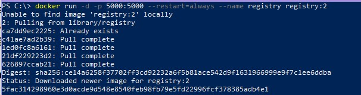
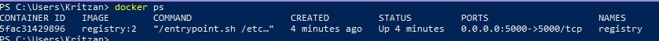
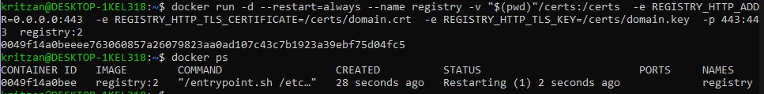
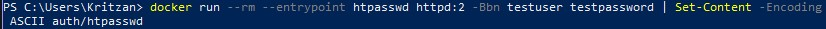
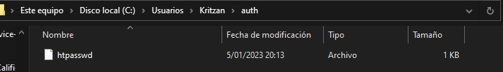
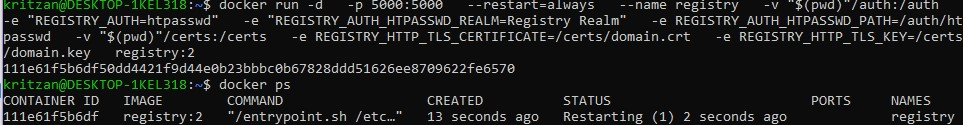

# PC5:
## PREGUNTA 1
### Actividad 23
#### Instalacion y uso de Docker Registry
* Instalacion de la aplicacion de Docker Registry  
Iniciamos la imagen de docker registry con el siguiente comando:  
 `docker run -d -p 5000:5000 --restart=always --name registry registry:2`.  
 Lo cual resulta:

Se crea un container que se lanza por el puerto 5000  

* Agregar un certificado de dominio  
Para generar tu propio certificado. Primero instalamos openssl. Luego creamos un directorio certs donde se almacenaran domain y domain.key  
```powershell
mkdir -p certs
openssl req \
  -newkey rsa:4096 -nodes -sha256 -keyout certs/domain.key \  
  -addext "subjectAltName = DNS:myregistry.domain.com" \
  -x509 -days 365 -out certs/domain.crt
```  
Ahora moveremos domain y domain key al directorio certs

* Agregar una restriccion de acceso  
Creamos un usuario y una contraseña utilizando htpasswd de la imagen del registro

Se crea el repositorio auth

Se establece los certificados  


Uso de docker registry
* Construyendo una imagen  
Creamos un nuevo directorio y en el un dockerfile que contiene:
 ```dockerfile
 FROM ubuntu:20.04
RUN apt-get update && \
apt-get install -y python 
 ```
 Construimos la imagen con el siguiente comando:
 ```powershell
 docker build -t ubuntu_with_python . 
 ```
 Revisamos que la imagen fue construida. Etiquetamos la imagen y ya que nos registramos previamente, almacenamos la imagen en el registro de la siguiente forma:

Verficamos que la imagen ha sido almacenada en la interfaz web de Docker Hub  

* Realizamos un pulling de la imagen del registro
Procedemos a eliminar la imagen localmente para luego poder recuperarla del registro, como se muestra:


Pruebas de aceptacion en el pipeline de Jenkins   
Crearemos un dockerfile en el proyecto calculador

Construimos el proyecto

Se crea la imagen de Docker, pero no se logra ejecutar con exito el contenedor


### Actividad 24
* Instalacion de kubernetes  
Instalacion finalizada y con exito de kubectl

Instalacion de minikube e iniciamos un cluster de kubernetes con exito

Verificamos la configuracion de kubernetes

Si ingresamos en nuestra web a https://127.0.0.1:51635/

* Implementacion de una aplicacion
creamos un archivo YAML.
```yaml
apiVersion: apps/v1
kind: Deployment
metadata:
name: calculador-deployment
labels:
app: calculador
spec:
replicas: 3
selector:
matchLabels:
app: calculador
template:
metadata:
labels:
app: calculador
spec:
containers:
- name: calculador
image: checha/calculador
ports:
- containerPort: 8080
```
