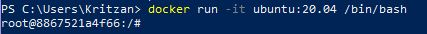
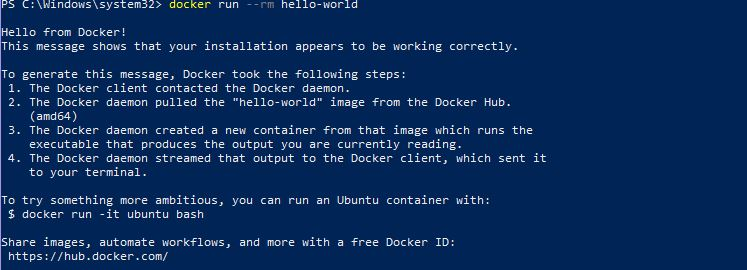

# Actividad 18

**Ejecutando docker hello-world**

**Aplicaciones docker**

Ejecutamos el servidor MongoDB

**Creacion de iamgenes de docker**

1.Ejecuta un contenedor desde ubuntu:20.04 y conectelo a tu linea de comando

Se extrajo la imagen de ubuntu:20.04, se ejecuta como contenedor y luego ingresa a la terminal del contenedor

2.Instala el kit de herramientas de git de la siguiente manera

3.Compreba si el kit de herramientas de git esta instalado ejecutando lo siguiente

4.Salga del contenedor, verificar que ah cambiado en el contenedor comparando suifdentificador(ID) de contendor unico con la imagen de ubuntu

5.Commit el contenedor a la imagen

Acabamos de crear nuestra primera imagen docker. Enumeramos todas las imagenes del host docker para ver si la imagen esta presente:

Creamos un contenedor a partir d ela imagen

**Dockerfile**

1.Crea un nuevo directorio y un archivo llamado dockerfile

2.Ejecut el siguiente comando para crear una imagen ubuntu_con_python:3. Verfica que la imagen se haya creado

3.Comprueba que la imagen se creo

**Aplicacion docker completa**

Crea un nuevo directorio y dentro de esre directorio, crear un archivo hola.py

Crea el dockerfile

Contruir la imagen excatamente d ela misma menera que lo hicimos antes

Ejecutar la aplicacion ejecutando el contenedor

**Variables de entorno**

1.Cambia la secuencia de comandos de python hola.py para usar la avariable de entorno

2.Contruye la imagen

3.Ejecuta el contenedor pasando la varable de entorno

4.Tambien podemos definir un valor de varibale de entorno en dockerfile

5.Ejecuta el contenedor

**Estados del contenedor Docker**

Ejecutar el contenedor en segundo plano con la opcion -d

mostramos todos los contenedores creados

podemos dejar de ejecutar el contenedor de ubuntu

**Redes docker**

**Servivios en uso**

Ejecutemos un servidor Tomcat directamente desde Dokcer Hub

verificamos que se estsa ejecutando

podemos acceder a el con lo siguiente

Si no hay errores, deberíamos ver muchos logs, lo que indica que Tomcat se ha iniciado y es accesible a través del puerto 8080. Podemos intentar ir a http:// localhost:8080, pero no podremos conectarnos. Esto se debe a que Tomcat se inició dentro del contenedor y estamos tratando de alcanzarlo desde el exterior. En otras palabras, podemos alcanzarlo solo si nos conectamos con el comando a la consola en el contenedor y lo verificamos allí.¿Cómo hacemos que ejecutar Tomcat sea accesible desde el exterior?

Entonces, primero detengamos el contenedor en ejecución y comenzamos uno nuevo, así:

Después de esperar unos segundos, Tomcat debería haberse iniciado y deberíamos poder abrir su
página: http://localhost:8080

**Redes de contenedores**

Las diferentes redes se pueden enumerar y administrar mediante el comando docker network

**Exponiendo puertos de contenedores**

**Asignacion automatica de puertos**

Intentemos ejecutar el segundo contenedor Tomcat sin detener el primero

Este error puede ser común. En tales casos, tenemos que encargarnos de la unicidad de los puertos por
nuestra cuenta o dejar que Docker asigne los puertos automáticamente

Podemos ver que la segunda instancia de Tomcat se ha publicado en el puerto 32772, por lo que se
puede navegar en http://localhost:32772.

**Volumenes de docker**

1.Especifica un volumne con la opcion -v <host_path>:<container_path> y luego conecta al contenedor

2.crea un archivo vacio en directorio_host en el contenedor

3.Comprueba si el archivo se creo ene le sustema de archivos del host docker

4.Podemos ver que el sistema de archivos se compartió y, por lo tanto, los datos se conservaron de forma permanente. Detén el contenedor y ejecuta uno nuevo para ver si el archivo todavía estará allí

**Limpieza de contenedores**

1. Para imprimir todos los contenedores (independientemente de su estado), podemos usar el comando docker ps -a

2.Para eliminar un contenedor detenido, podemos usar el comando docker rm (si un contenedor se está ejecutando, primero debemos detenerlo)

3.Si queremos eliminar todos los contenedores detenidos

4.También podemos adoptar un enfoque diferente y pedirle al contenedor que se elimine tan pronto como se detenga usando el indicador --rm

**Limpieza de imagenes**

1.Para verificar todas las imágenes en el contenedor de Docker, podemos usar el comando de imágenes de Docker (docker images) $ docker images

2.Para eliminar una imagen, podemos llamar al siguiente comando: $ docker rmi 48b5124b2768

3.En el caso de las imágenes, el proceso de limpieza automática es un poco más complejo. Las imágenes no tienen estados, por lo que no podemos pedirles que se eliminen cuando no se usan. Una estrategia
común sería configurar un trabajo de limpieza de cron, que elimina todas las imágenes antiguas y no utilizadas

